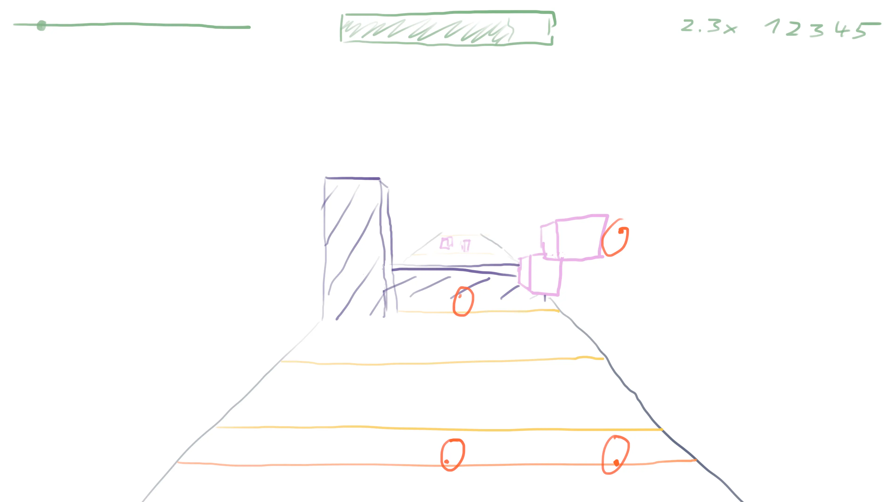

# Gameplay

<h2 style="color: #7fb486">Stats</h2>

left: level progress indicator

middle: health bar

right: score multiplier and score

<h2>Main Game Area</h2>

<h3 style="color: #ebb0e8">Collectibles</h3>

The player's goal is to destroy all collectibles by touching them. There are different types of obstacles. Ones that can be destroyed by and hand or foot and ones that require a specific hand or foot to be destroyed. Destroying a collectible adds score points, increases the score multiplier slightly and adds back health. Missing a collectible resets the score multiplier. Health is decreased over time, but in a way that it can be kept in a high fill grade even if there are no collectibles for a longer stretch. 

<h3 style="color: #6c569f">Obstacles</h3>

Obstacles should be avoided by the player. Hitting an obstacles briefly disables the player's ability to pick up collectibles. This is indicated by a slight camera shake and desaturation.

<h3 style="color: #596c73">Ground</h3>

The ground has no gameplay effect, but serves to direct the player's attention towards the center of the screen.

<h3 style="color: #ff8d2e">Playhead</h3>

Indicates to the player when a collectible should be hit.

<h3 style="color: #ff8d2e">Hand and Feet Holograms</h3>

These holograms are mapped to the players hands and feet via camera based pose detection. They can only be moved on a plane perpendicular to the time axis above the Playhead. When we are referring to the player's hands and feet, we mostly talk about these virtual representations.

<h3 style="color: #facb35">Full Beat Indicators</h3>

Indicates full beats of the music track to the player. Level editors should usually place collectibles and obstacles in time fractions relative to the lines in order to fit the level to the music.