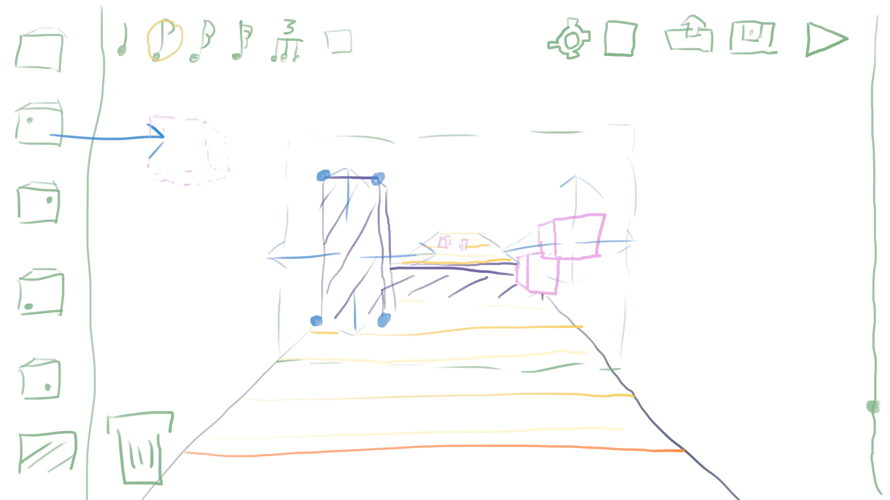

# Level Editor

The level editor is intended to be used with a keyboard and mouse.

## Navigating through a level

The default way to navigate through the level along the time axis is using either the mouse wheel or holding the right mouse button and moving the mouse along the screen-y direction. Additionally there is the timeline (see below).

<h2 style="color: #7fb486">Interactable UI</h2>

### Palette (left)

Contains a list of things, which can be placed in the level.

### Time Snapping (top left)

Can be clicked in order to activate different snapping anchors for moving through the time axis (perpendicular to the screen). The list includes quarter beats, 1/8th beats, 1/16th beats, 1/32th beats, triplets and free placement. Triplets can be combined with quarter beats, 1/8th beats, 1/16th beats and 1/32th beats. Depending on the selection, there will be indicators on the ground for reference and easier understanding by people who don't know music theory.

### Trash bin (bottom left)

Collectibles and obstacles can be dragged here for deletion.

### Other UI (top right)

#### Settings

Opens a dialog for configuring meta data like title, duration, linked audio information (e.g. link to a shop page), and bpm configuration.

#### New File

Opens a dialog for creating a new level.

#### Load Level

Opens a dialog for loading a level.

#### Play / pause

Plays back / pauses the level.

### Timeline (right)

Allows the player to go to different parts of the level quickly.

### Placement Indicator (middle)

This pane indicates where objects dropped from the palette will be placed initially in the time axis.

<h3 style="color: #596c73">Ground</h3>

Here for consistency with the gameplay.

<h4 style="color: #ff8d2e">Playhead</h4>

Here for consistency with the gameplay.

<h4 style="color: #facb35">Full Beat Indicators</h4>

Indicates full beats of the music track to the level editor. Level editors should usually place collectibles and obstacles in time fractions relative to the lines in order to fit the level to the music.

<h4 style="color: #facb35">Beat Fraction Indicators</h4>

If something else than quarter beats or free placement is selected for time snapping, then these indicators will appear to help with understanding time snapping intuitively.

<h3 style="color: #ebb0e8">Collectibles</h3>

Clicking a collectible will highlight it. Dragging it will move it in 2D around the screen without affecting the placement on the time axis. Dragging the mouse in screen-y direction while holding the left mouse button and the shift-key or only the right mouse button will move it along the time axis. Alternatively it can be moved around the time axis by dragging it and using the mouse wheel. Hitting x or delete will delete the currently selected (last highlighted) collectible. Alternatively they can be dragged to the trash bin.

Collectibles can be placed in the level by dragging and dropping them from the palette.

<h3 style="color: #6c569f">Obstacles</h3>

Clicking an obstacles will highlight it. Dragging it will move it in 2D around the screen without affecting the placement on the time axis. Dragging the mouse in screen-y direction while holding the left mouse button and the shift-key or only the right mouse button will move it along the time axis. Alternatively it can be moved around the time axis by dragging it and using the mouse wheel. Hitting x or delete will delete the currently selected (last highlighted) collectible. Alternatively they can be dragged to the trash bin. It can be resized in the 2D space perpendicular to the time axis by dragging the resized handles at its corners. It can be resized along the time axis by moving the mouse in screen-y direction while having it selected and holding control or alternatively using the mouse wheel while dragging it.

Obstacles can be placed in the level by first selecting their icon in the palette, then specifying two points of them in the level by clicking two times. If these two clicks happen without a change of the placement indicators position, the obstacle will be created with a default depth. Otherwise, the two clicks specify a 3D cuboid.