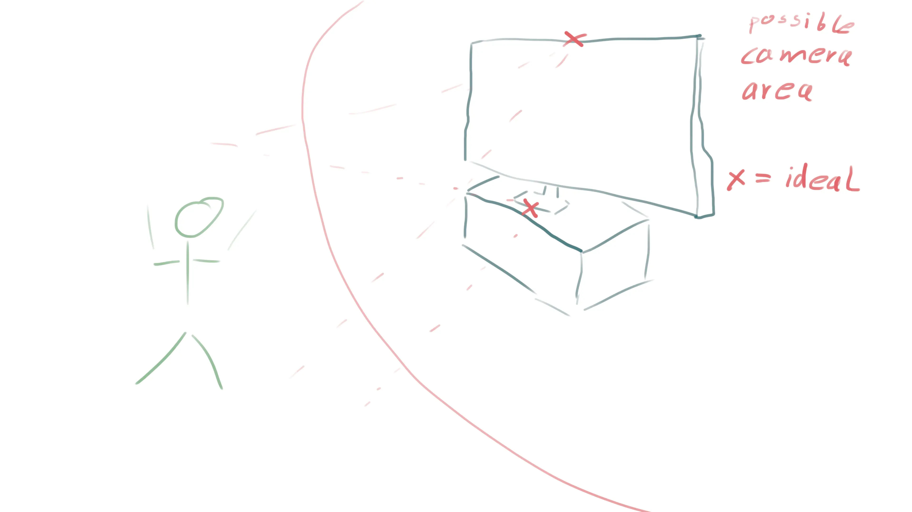

# Physical Setup

1. Clear out space for dancing in front of TV.
2. Connect a device with a browser and camera to TV.
3. Place camera facing yourself and point it at you.
4. Run calibration, if camera is not in ideal position.